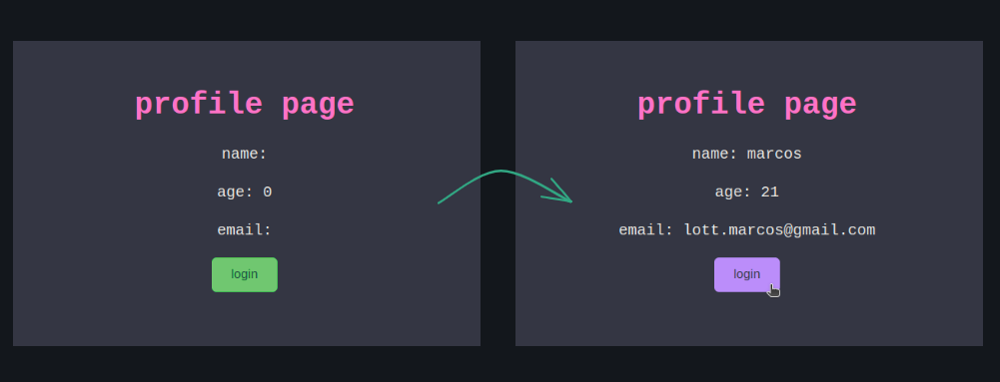

# redux

I'm creating this repository to save my studies of the `redux library` and document them in this readme.md file so that I can assist other people in understanding it in a straightforward manner.

so, to get started, let's dive right in!

in essence, if I were to summarize redux in a single sentence, I would say that redux is a very well known library that allows you to manage states in your `react application`.

<p align="center">
  
</p>

## what is state management?

to explain the importance of state management and how redux can help us do that I created this simple diagram:

<p align="center" style='width:400px'>
  
</p>

imagine that we have this `app component` that has 2 others components: `login` and `profile`.

the `login component` is where you write the code to log into an user profile, filling in your username, email, and any other information associated with an user.

on the other hand, we have the `profile component`, which is where the user can view and edit their information once they're already logged in.

so, the main idea here is that we want to access the same state (user information) in both of these components. however, we don't want to pass this information as props to them, as it could lead to a messy and disorganized codebase.

for this reason, we want to focus on state management for different states that we need to access throughout the component tree, and redux allows us to achieve that.

## how can we hold information?

let's introduce the concept of a `store`. a store is essentially a container, something that holds information. so, when we create a store in redux, it serves as a place to store all the states you want to make `global`, allowing you to access them throughout your entire application.

to create a store, we just need to import the function called `configureStore` from the `redux-toolkit` library and pass your reducers into it. after that, we are able to create a `provider` to wrap our `app component` so it can have access to all of the information contained in the store.

```jsx
import React from "react";
import { Provider } from "react-redux";
import ReactDOM from "react-dom/client";
import { configureStore } from "@reduxjs/toolkit";

import App from "./App";
import userReducer from "./features/user";

const store = configureStore({
  reducer: {
    user: userReducer,
  },
});

const root = ReactDOM.createRoot(document.getElementById("root"));
root.render(
  <React.StrictMode>
    <Provider store={store}>
      <App />
    </Provider>
  </React.StrictMode>
);
```

but what exactly is a `reducer`? well, a reducer is just a function that takes the `previous value` of the state and an `action` so it can change the value of the state in response to that action.

that's how we hold all of the information needed for our code to work! we are going to have reducers for all of the different states we want to have in our application so we can manage them properly.

## how can we create a reducer?

to build our `user state reducer`, we are going to use a function called `createSlice` that allows you to create a reducer easily, making it very intuitive for you to split your logic and access it throughout your application.

```jsx
import { createSlice } from "@reduxjs/toolkit";

const userSlice = createSlice({
  name: "user",
  initialState: { value: { name: "", age: 0, email: "" } },
  reducers: {
    login: (state, action) => {
      state.value = action.payload;
    },
  },
});

export const { login } = userSlice.actions;
//exporting the login action to update the state

export default userSlice.reducer;
//exporting the reducer so we can access the state's values
```

as we can see, our `slice` has 3 properties: name, initialState, and the reducers. the reducers receive our functions, and each function takes 2 parameters:

- `state`, which is the previous state stored in the app. So, in this case, the state will have a value that is an object with name, age, and email.
- `action`, which is the data that represents an intention to change the state and is the only way to send data from your application to the Redux store. Actions have two properties:
  - `payload` which is the additional data used to update the state.
  - `type` which indicates the type of action being performed. It is used to manipulate the payload conditionally (I'm not going to set a type because it is just a simple application).

## how we can update the state?

to update the states values we are going to use the `useDispatch` hook from redux, so we can can dispatch the state into the reducer. to use this hook we just pass into it, as a parameter, the action we exported from our reducer using the new payload.

```jsx
import React from "react";
import { useDispatch } from "react-redux";
import { login } from "../features/user";

function Login() {
  const dispatch = useDispatch();

  const user = {
    name: "marcos",
    age: 21,
    email: "lott.marcos@gmail.com",
  };

  return (
    <div>
      <button onClick={() => dispatch(login(user))}>login</button>
    </div>
  );
}

export default Login;
```

by doing that, as we click on the login button, we are updating the user state value into the reducer!

## how can grab the data stored?

to grab the information we want from the reducers, we use the `useSelector` hook to access the values of the states. this hook takes in a function which allows you to specify which state you want to access, which, in our case, is the `user` state.

```jsx
import React from "react";
import { useSelector } from "react-redux";

function Profile() {
  const user = useSelector((state) => state.user.value);

  return (
    <div>
      <h1>profile page</h1>
      <p>name: {user.name}</p>
      <p>age: {user.age}</p>
      <p>email: {user.email}</p>
    </div>
  );
}

export default Profile;
```

so, as we click the login button, we are able to see the new values of the user state:

<p align="center">
  
</p>

## conclusion

in conclusion, redux is a powerful state management library that helps you maintain and control the state of your React application. It allows you to create a `store` to store your global states, use `reducers` to manage these states, use `dispatch` to update them, and use `selectors` to access and display the stored data. this structured approach simplifies state management and enhances the organization of your code, making it easier to develop and maintain complex applications.

i really hope that this can help you to learn a new skill or to improve your code thinking. see you later! 👋👋
