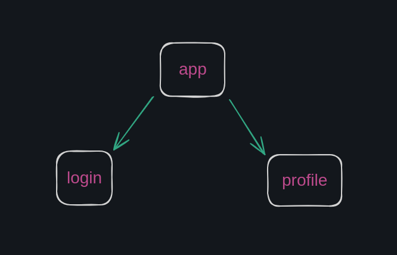

# redux

I'm creating this repository to save my studies of the redux library and document them in this readme.md file so that I can assist other people in understanding it in a straightforward manner.

So, to get started, let's dive right in!

In essence, if I were to summarize Redux in a single sentence, I would say that redux is a very well known library that allows you to manage states in your React application.

## what is state management?

To explain the importance of state management and how redux can help us in doing that I made this simple diagram:

  

Imagine that we have this app component that has 2 others components: login and profile.

The login component is where you write the code to log into a profile, filling in your username, email, and any other information associated with a profile.

On the other hand, we have the profile component, which is where you can view and edit the information in your profile once you're already logged in.

So, the main idea here is that we want to access the same state (profile information) in both of these components. However, we don't want to pass this information as props to them, as it could lead to a messy and disorganized codebase.

For this reason, we want to focus on state management for different states that we need to access throughout the component tree, and redux allows us to achieve that.
